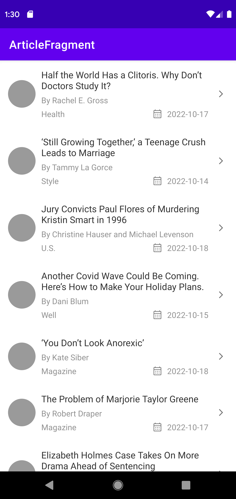
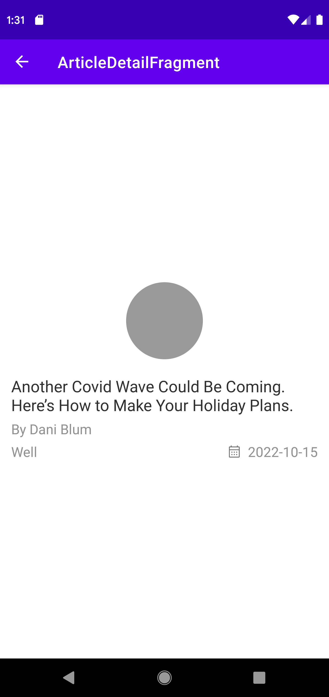

# NYArticles

This application shows a list of articles published on [New York Times][1]. Each item in the list is showing the title, by line, section and updated date of that article. 

* Main screen of the application

* Detail screen of the application

# Installation instructions

## Android 8 or above

## Samsung devices

* On your device, tap Settings > Apps.
* At the top-right, tap Vertical meet ball/ellipsis icon.
* Tap Special access > Install unknown apps.
* Tap the browser from where you will download the APK, such as Chrome.
* If prompted, toggle Allow from this source on.

## Non-Samsung devices
* On your device, go to Settings.
* Tap Apps & notifications > Advanced.
* Tap Special app access.
* Tap Install unknown apps.
* Tap the browser from where you will download the APK, such as Chrome.
* If prompted, toggle Allow from this source on.

## Shortcut way
* On your device, go to Settings.
* Tap on magnify glass/search icon
* Type special app access in the search bar
* Tap Special app access.
* Tap Install unknown apps.
* Tap the browser from where you will download the APK, such as Chrome.
* If prompted, toggle Allow from this source on.

## Android 7 or below

* On your device, tap Settings.
* Tap Security.
* Under Device administration, toggle Unknown sources on.

## Applicatoin Development

The app is built using MVVM and clean architecture pattern. Following is the list of API used in development

* Kotlin 
* Coroutines
* Flows
* Livedata
* Room database
* Navigation
* Dagger Hilt for DI
* Retrofit

[1]: https://api.nytimes.com
